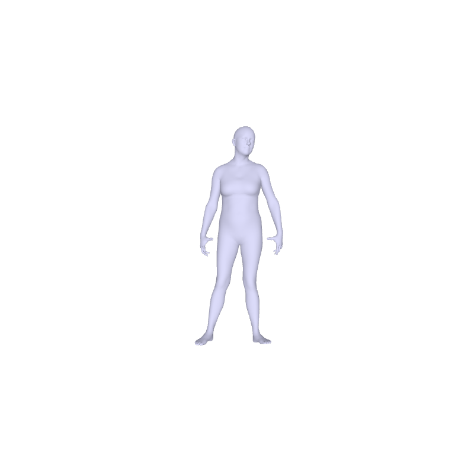
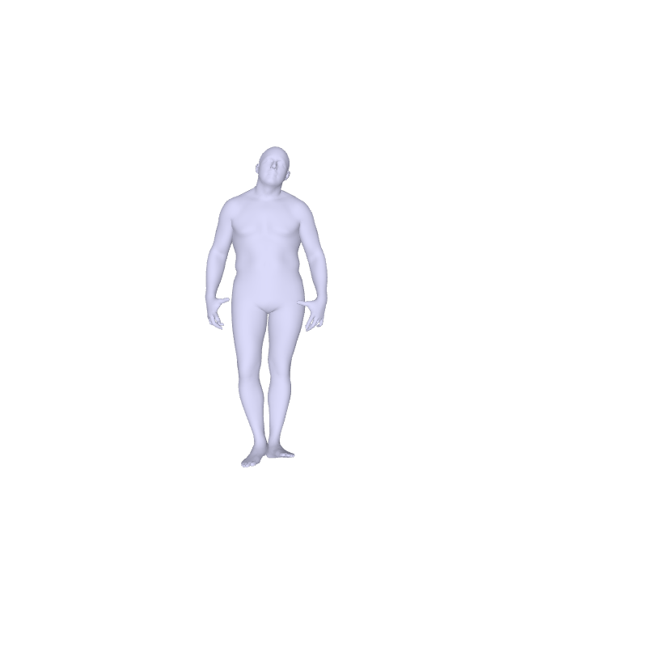

# [GATI-GPT](https://www.bheri.in/BHERIGPT) : Gait and Temporal Intelligence GPT 

### **A Large-Scale Multi-View Movement Dataset of Daily Activities in the Indian Context**

---

### **Abstract**

We present GATI-GPT (Gait and Temporal Intelligence GPT), a high-fidelity movement dataset of daily activities performed by Indian subjects. The dataset consists of 16 subjects performing various activities, including domestic chores, exercises, and yoga postures. We provide pose estimation metrics extracted from state-of-the-art pose estimation models, such as MotionAGFormer, MHFormer, PoseFormerV2, and MediaPipe, evaluated across four camera viewing angles, pose and velocity estimation errors, along with segment length errors relative to the ground truth. We also provide SMPL-style representations for our dataset, obtained using a motion-capture system, to support this work. We believe this dataset will have a significant impact on the fields of robotics, computer vision, and personalized rehabilitation technology by providing biomechanically grounded human movement sequences.

---

### **Data Format**

#### **Pose Estimation Metrics**
We provide pose estimates from state-of-the-art pose estimation models, including [MotionAGFormer](https://github.com/TaatiTeam/MotionAGFormer), [MHFormer](https://github.com/Vegetebird/MHFormer), [PoseFormerV2](https://github.com/QitaoZhao/PoseFormerV2), and [MediaPipe](https://github.com/google-ai-edge/mediapipe), captured using a multi-view camera setup. The pose estimates are provided as `csv` files containing the human pose estimations from the four models in the multi-view setting.

#### **Error  Metrics**
The joint position and velocity errors are computed by treating the motion-capture system as the ground truth for pose representation. Further the segment length errors relative to the ground truth motion capture system are also provided 
The resulting error metrics for each pose estimation model are provided as `csv` files.

<!-- #### **Segment Length Error Metrics**
The joint position and velocity errors are computed by treating the motion-capture system as the ground truth for pose representation. The resulting error metrics for each pose estimation model are provided as `csv` files. -->

#### **SMPL Representation**
The high-frequency motion-capture data, consisting of 43 optical markers is processed, using [MoSh++](https://github.com/nghorbani/moshpp) to obtain [SMPL-H](https://mano.is.tue.mpg.de/) models that include the global trajectory, 52 joint rotations, and shape parameters stored in a `npz` file. A common subject-wise shape estimation is performed using MoSh, followed by frame-wise pose estimation for each activity in the dataset. The data is downsampled to 50 Hz to retain a compact representation. Please refer to [AMASS](https://github.com/nghorbani/amass) for details regarding the visualization of these SMPL figures.

---

### **Download the Dataset**
The full dataset consisting of the pose estimates, errors, and SMPL parameters can be downloaded [[here]()]

---

### **Previews**

   
   
   
  

### **Liscense**
This Dataset is licensed under [Creative Commons Attribution-NonCommercial 4.0 International License](LICENSE).The datset is processed using SMPL , Mosh++ and PyTorch3D each having their own liscence.